# Agent-Enabled Markdown Report Editor

A collaborative web application for drafting Markdown-based reports with real-time collaboration and AI agent assistance.

## Key Features

- **Block-based editing**: Sections and blocks with fine-grained tracking and attribution
- **Real-time collaboration**: Near real-time syncing via Convex with section-level locking
- **AI agent integration**: Persistent agent threads, context-aware suggestions, diff-based review workflow
- **Version history**: Whole-document snapshots with restore capability
- **Comments & mentions**: Unified comment system supporting human and agent assignments with @section references
- **Artifact uploads**: Attach files (CSV, HTML, PDF) for agent context

## Architecture Overview

This is a 3-tier application:

| Layer | Directory | Runs On | Purpose |
|-------|-----------|---------|---------|
| **Web App** | `apps/web` | Vercel (static) | React SPA with Vite, TypeScript, TailwindCSS |
| **Backend** | `convex/` | Convex Cloud | Real-time data sync, business logic, schema |
| **Agent Sandbox** | `apps/sandbox` | Daytona | Python FastAPI for LLM orchestration |

```mermaid
flowchart TB
    subgraph Client["🌐 Browser"]
        Web["React SPA<br/>(apps/web)"]
    end
    
    subgraph Vercel["☁️ Vercel"]
        Static["Static Hosting"]
    end
    
    subgraph ConvexCloud["☁️ Convex Cloud"]
        Backend["Convex Backend<br/>(convex/)"]
        DB[(Database)]
        Backend --> DB
    end
    
    subgraph Daytona["☁️ Daytona Sandbox"]
        Sandbox["Python FastAPI<br/>(apps/sandbox)"]
        LLM["OpenAI / Anthropic"]
        Sandbox --> LLM
    end
    
    Web -->|"WebSocket<br/>Real-time sync"| Backend
    Backend -->|"HTTP POST<br/>/v1/agent/run"| Sandbox
    Sandbox -->|"Proposed edits"| Backend
    Static -.->|"Serves"| Web
```



<details>
<summary>ASCII version</summary>

```
┌─────────────────────────────────────────────────────────────────────┐
│  🌐 Browser                                                         │
│  ┌─────────────────┐                                                │
│  │   React SPA     │                                                │
│  │   (apps/web)    │                                                │
│  └────────┬────────┘                                                │
└───────────┼─────────────────────────────────────────────────────────┘
            │ WebSocket (real-time sync)
            ▼
┌─────────────────────────────────────────────────────────────────────┐
│  ☁️ Convex Cloud                                                     │
│  ┌─────────────────┐      ┌──────────┐                              │
│  │ Convex Backend  │──────│ Database │                              │
│  │    (convex/)    │      └──────────┘                              │
│  └────────┬────────┘                                                │
└───────────┼─────────────────────────────────────────────────────────┘
            │ HTTP POST /v1/agent/run
            ▼
┌─────────────────────────────────────────────────────────────────────┐
│  ☁️ Daytona Sandbox                                                  │
│  ┌─────────────────┐      ┌──────────────────┐                      │
│  │ Python FastAPI  │──────│ OpenAI/Anthropic │                      │
│  │ (apps/sandbox)  │      └──────────────────┘                      │
│  └─────────────────┘                                                │
└─────────────────────────────────────────────────────────────────────┘
```

</details>

### Why a Separate Sandbox?

The sandbox isolates AI/LLM processing from the Convex backend:

| Reason | Explanation |
|--------|-------------|
| **Security** | LLM API keys stay server-side, never exposed to the browser |
| **Decoupling** | Heavy LLM calls don't block real-time database operations |
| **Python** | Better AI/ML ecosystem for LLM SDKs and future code execution |
| **Human-in-the-loop** | Returns proposed edits for user review before applying |

## Quick Start

### Prerequisites

- Node.js >= 18.0.0
- pnpm >= 8.0.0
- Python >= 3.11
- Convex CLI (`npm install -g convex`)

### Installation

```bash
# Install dependencies
pnpm install

# Set up Convex
cd convex
npx convex dev
# Follow prompts to create a project

# Set up Python sandbox (requires uv: https://docs.astral.sh/uv/)
cd apps/sandbox
uv sync
```

### Development

```bash
# Run all services (from root)
pnpm run dev

# Or run individually:
pnpm --filter web dev          # Web app on http://localhost:5173
pnpm --filter sandbox dev      # Sandbox on http://localhost:8000
npx convex dev                 # Convex in dev mode
```

### Testing

```bash
# Run all tests
pnpm run test:ci

# Individual test suites
pnpm test           # Unit tests
pnpm test:integ     # Integration tests
pnpm test:e2e       # End-to-end tests
```

## Documentation

- [Architecture](docs/architecture.md) - System design and data flow
- [Data Model](docs/data-model.md) - Convex schema and storage rationale
- [Locks & Versions](docs/locks-and-versions.md) - Lock semantics and version snapshots
- [Agent Threads](docs/agent-threads.md) - AI thread lifecycle and integration
- [Testing Guide](docs/testing.md) - How to write and run tests
- [Development Setup](docs/development-setup.md) - Detailed environment setup
- [Deployment Guide](DEPLOY.md) - How to deploy to production
- [Contributing](CONTRIBUTING.md) - How to contribute to this project
- [Contributing for Agents](docs/contributing-for-agents.md) - Quick guide for AI coding tools

## Project Structure

```
report-writer/
├── apps/
│   ├── web/              # React frontend
│   └── sandbox/          # Python agent sandbox
├── convex/               # Convex backend
│   ├── schema.ts         # Data schema
│   ├── mutations.ts      # State mutations
│   ├── queries.ts        # Data queries
│   └── actions.ts        # HTTP calls to sandbox
├── packages/
│   └── shared-types/     # Shared TypeScript types
├── tests/
│   ├── integration/      # Cross-service tests
│   └── e2e/              # Playwright tests
└── docs/                 # Documentation
```

## License

MIT - See [LICENSE](LICENSE) file for details.
