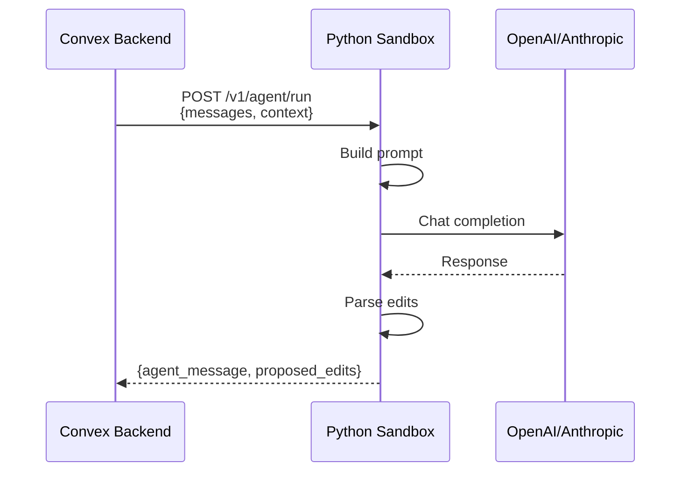

# Sandbox Service

Python-based LLM orchestration service for report-writer.

## Why a Separate Sandbox?

The sandbox exists to **isolate AI processing from the main Convex backend**:

| Reason | Explanation |
|--------|-------------|
| **Security** | LLM API keys stay here, never exposed to the browser |
| **Decoupling** | Heavy LLM calls don't block real-time database sync |
| **Python** | Better AI/ML ecosystem (LLM SDKs, future code execution) |
| **Scaling** | AI workloads scale independently from database operations |

### How It Fits Together



<details>
<summary>ASCII version</summary>

```
Convex Backend                    Python Sandbox                   LLM
     │                                  │                           │
     │  POST /v1/agent/run              │                           │
     │  {messages, context}             │                           │
     │─────────────────────────────────▶│                           │
     │                                  │  Build prompt             │
     │                                  │───────────────────────────▶
     │                                  │                           │
     │                                  │◀───────────────────────────
     │                                  │  Parse proposed edits     │
     │◀─────────────────────────────────│                           │
     │  {agent_message, proposed_edits} │                           │
```

</details>

The sandbox receives document context and chat history, calls the LLM, parses the response, and returns proposed text edits. Convex stores these for user review.

## Setup

1. **Install dependencies** (requires [uv](https://docs.astral.sh/uv/)):
   ```bash
   uv sync
   # Or for development with dev dependencies:
   uv sync --dev
   ```

2. **Configure environment:**
   ```bash
   cp .env.example .env
   # Edit .env with your API keys
   ```

3. **Run the server:**
   ```bash
   uv run python src/sandbox/main.py
   # Or:
   uv run uvicorn sandbox.main:app --reload
   ```

## API Endpoints

### Health Check
```
GET /health
```

### Agent Run
```
POST /v1/agent/run
```

**Request:**
```json
{
  "thread_id": "string",
  "messages": [{"role": "user", "content": "string"}],
  "context": {
    "sections": [{"id": "string", "title": "string"}],
    "blocks": [{"id": "string", "markdown_text": "string"}]
  }
}
```

**Response:**
```json
{
  "agent_message": "string",
  "proposed_edits": [
    {"block_id": "string", "new_markdown_text": "string"}
  ]
}
```

## CLI Tool: `report-agent`

The sandbox includes a CLI for report generation and inspection.

**Run the CLI:**
```bash
uv run report-agent --help
```

### Commands

**Generate a single section:**
```bash
uv run report-agent generate-section \
  --outline report-outline.md \
  --data-root ./data \
  --section introduction \
  --output output/introduction.md
```

**Generate a full report:**
```bash
uv run report-agent generate-report \
  --outline report-outline.md \
  --data-root ./data \
  --output output/report.md
```

**Inspect available charts:**
```bash
uv run report-agent inspect-charts --data-root ./data
```

**Inspect section structure:**
```bash
uv run report-agent inspect-sections --outline report-outline.md --show-charts
```

**Run evaluation on a reviewed report:**
```bash
uv run report-agent run-eval \
  --outline reviewed-report.md \
  --run-id eval-001 \
  --output eval-results.json
```

### Common Options

- `--model`, `-m`: LLM model to use (default: `o3`)
- `--thinking`, `-t`: Thinking level: `low`, `medium`, `high`
- `--dry-run`: Show what would be sent without calling the LLM
- `--verbose`, `-v`: Show detailed progress

## Project Structure

```
apps/sandbox/
├── src/sandbox/
│   ├── main.py              # FastAPI app
│   ├── api/
│   │   └── agent_run.py     # Agent endpoints
│   ├── core/                # Business logic
│   └── test_doubles/        # Test utilities
├── pyproject.toml           # Dependencies
├── Dockerfile               # Container config
└── README.md
```
